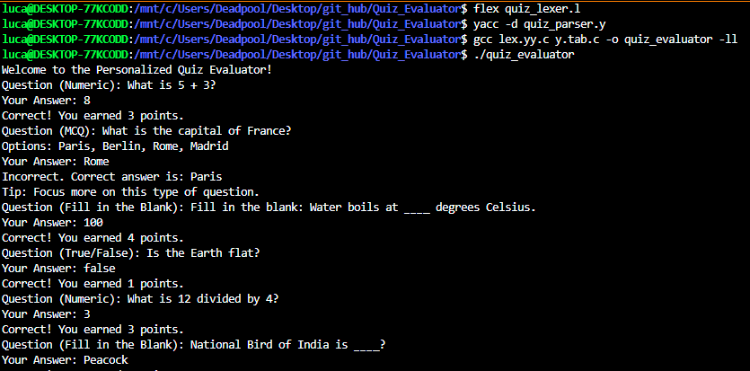
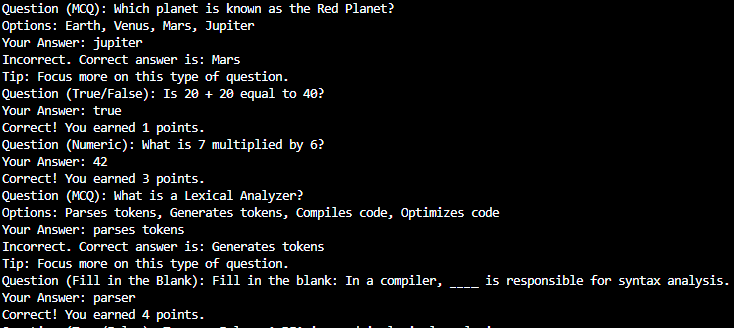
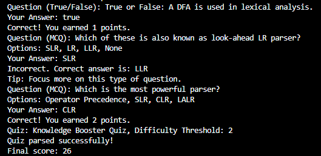

# Quiz Evaluator

## Project Overview
The **Quiz Evaluator** is a program designed to evaluate answers to various types of questions, including Multiple Choice Questions (MCQs), True/False, and Fill in the Blanks. It provides a final score based on the answers, and for each incorrect answer, helpful tips are provided to guide the user. The program reads input from a text file, processes the questions and answers, and presents the quiz in the terminal.

The following files are included in the project:
- **quiz_input.txt**: The input file containing the quiz questions and answers.
- **quiz_lexer.l**: The Lex source file responsible for tokenizing the input.
- **quiz_parser.y**: The Yacc source file containing the grammar rules to parse the quiz questions and answers.

### Intermediate Files (Ignored)

The following intermediate files are generated during the process and are ignored by Git to prevent cluttering the repository:

- **lex.yy.c**: The C source file generated by Flex.
- **y.tab.c, y.tab.h**: The C source and header files generated by Bison.
- **quiz_evaluator**: The compiled binary of the program.

These files are ignored using a `.gitignore` file to avoid confusion and ensure that only the necessary source code and configuration files are included in the repository.

## Features

- **Question Types Supported**:
  - **Fill in the Blank**
  - **Multiple Choice Questions (MCQs)**
  - **True/False**
  - **Numeric Questions**
- **Case-insensitive answer comparison**: Users can provide answers with different cases (e.g., "peacock" and "Peacock" will be treated as equivalent).
- **Score calculation**: Points are awarded for correct answers. Incorrect answers provide a helpful tip based on difficulty.
- **Handles dynamic input**: Questions and answers are read from a quiz input file.

## Input File Format
Below is an example of the format of the **quiz_input.txt** file:

```txt
# Sample input format
QUIZ "Knowledge Booster Quiz"
THRESHOLD 2

QUESTION "What is 5 + 3?"
TYPE NUMERIC
CORRECT 8

QUESTION "What is the capital of France?"
TYPE MCQ
OPTIONS "Paris" "Berlin" "Rome" "Madrid"
CORRECT "Paris"

QUESTION "Fill in the blank: Water boils at ____ degrees Celsius."
TYPE FILL_IN_BLANK
CORRECT "100"

QUESTION "Is the Earth flat?"
TYPE TRUE_FALSE
CORRECT "FALSE"

```
Ensuring that each question follows the proper format with a clear indication of the question type (MCQ, True/False, or Fill in the Blank).


## Compilation Steps

## Lexical Analysis (Lex)

The `quiz_lexer.l` file is responsible for reading the input file and generating tokens for different question types, options, and answers. The lexer takes the input file (`quiz_input.txt`) and processes it to generate tokens.

### Lex Code

The `quiz_lexer.l` defines regular expressions to match the input patterns for questions, types, options, and answers. It uses these patterns to generate tokens that will be passed to the Bison parser for further processing.

### Compilation Command for Lex

To generate the C source file for Lex, run the following command:

```bash
flex quiz_lexer.l
```

This will generate `lex.yy.c`. The lexer uses this C source file to convert the input into tokens that the parser can understand.

## Parsing with Bison

The `quiz_parser.y` file is the Bison grammar file that defines how the tokens generated by Lex are parsed and interpreted. It processes the quiz structure, assigns points, and checks for the correctness of user input.

### Bison Code

The Bison/yacc code defines the grammar for questions, types, and answers, including logic to handle different question types and evaluate user answers.

### Compilation Command for Bison/yacc

To generate the parsing code, run the following command:

```bash
yacc -d quiz_parser.y
```

This will generate `y.tab.c` and `y.tab.h`. These files contain the code required for parsing the tokens generated by Lex.

## Compiling the Code

Once Lex and Yacc files are processed, you can compile the entire program using GCC:

```bash
gcc lex.yy.c y.tab.c -o quiz_evaluator -ll
```

This command will generate the executable `quiz_evaluator`.

## Running the Program

To run the quiz evaluator, use the following command:

```bash
./quiz_evaluator
```

The program will read the quiz questions from `quiz_input.txt`, present them to the user, and prompt the user for their answers. After each question, it will evaluate the answer and provide feedback (correct or incorrect), along with the score.

## Results/Output
Below are the screenshots showing the output in the terminal after running the quiz evaluator:

1. Screenshot showing the commands to run and quiz questions being displayed.

2. Screenshot showing the user answering the qiz questions.

3. Screenshot showing the final results, including the score and tips for incorrect answers.


## Conclusion
This project demonstrates the integration of Lex and Yacc for building a quiz evaluator that can handle different types of questions and evaluate the user's answers. It showcases how lexical analysis and parsing work together to process user input and generate a useful output. The final score and helpful tips for incorrect answers make it an interactive and educational tool for users.
